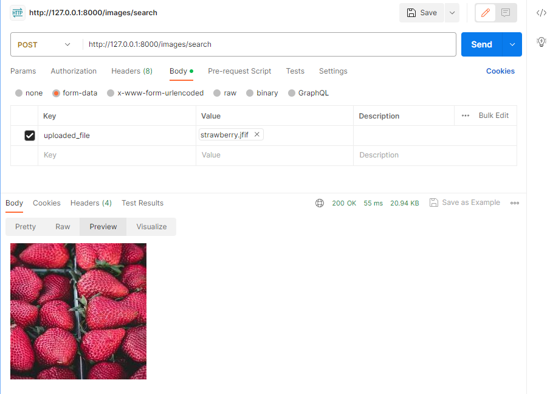

## Similar image search using Qdrant and MlpMixer
This project uses a modified subset of the [vision transformer](https://github.com/google-research/vision_transformer) repository for creating image embeddings. See `vit_jax/README.md` for more details on the modifications made. 

## Getting Started
### Requirements
Install the requirements
```
python3 -r requirements.txt
```

This will not work on windows per jax's limitations.

Obtain a copy of the MlpMixer-B_16 checkpoint from the [official google cloud storage](https://console.cloud.google.com/storage/browser/mixer_models).

### Running the server
`python3 main.py`

### Populating the database
Either save your images under `static/` and it should populate it on first startup or POST it to `http://127.0.0.1:8000/images` as a form-data with key `uploaded_file`

### Searching image
Currently, the most convenient way is to send a POST request to the search endpoint using a tool that can render HTML response 


*HTML response rendered in Postman*

## TODOs
In general, the whole project lacks polish and completeness, but works as a quick experiment into getting MlpMixer and Qdrant to work together. 